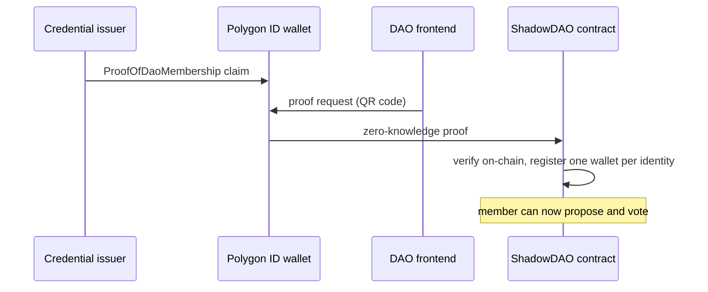

# Shadow DAO

A private DAO where membership is proven with **zero-knowledge proofs**. Members show the contract that they hold a valid membership credential, using Polygon ID, without revealing who they are. Each real identity can register exactly one wallet, so the DAO is sybil-resistant without collecting anyone's personal data.

**Live app:** [polygon-id-frontend.vercel.app](https://polygon-id-frontend.vercel.app/) · **Frontend:** [`frontend/`](frontend) · **Credential schemas:** [`schemas/`](schemas)


## How it works



1. **Get a credential.** A member receives a `ProofOfDaoMembership` claim from the issuer into their Polygon ID wallet. The owner gets an owner claim the same way.
2. **Prove it.** The frontend shows a QR code with a proof request. The wallet generates a zero-knowledge proof that it holds the claim, and submits it to the contract.
3. **Verify on-chain.** `ShadowDAO` inherits Polygon ID's `ZKPVerifier`, and checks the proof with the credential-query validators (signature and Merkle-tree-proof circuits). Only the proof is verified; the contract never sees the credential's contents.
4. **One identity, one wallet.** The contract records the identity's public id against the wallet, so the same person can't register a second address. The owner can revoke a membership, or clear an identity so it can re-register with a new wallet.
5. **Govern.** Anyone can donate to the treasury. Verified members create proposals, with a description and the amount they need, and vote once each within a 500-block window. After the deadline, the owner counts the votes, and a passed proposal is paid from the treasury to its proposer.

Two request ids keep the roles apart: `MEMBER_REQUEST_ID` registers members, and `OWNER_REQUEST_ID` hands ownership to whoever proves the owner credential.

## Verifying in the app

| 1. Scan the proof request | 2. Approve in the wallet | 3. Verified |
|---|---|---|
|  |  |  |

## Repository

| Folder | |
|---|---|
| [`contracts/`](contracts) | The DAO contract, Polygon ID's verifier and validators, and iden3 libraries (Hardhat project at the root) |
| [`frontend/`](frontend) | The React app: wallet connection, QR proof requests, proposals, voting, treasury, owner console |
| [`schemas/`](schemas) | The `ProofOfDaoMembership` and `ProofOfDaoOwnership` credential schemas (JSON and JSON-LD) |
| [`scripts/`](scripts) | Deployment and verification scripts |

## Contracts

| File | |
|---|---|
| [`contracts/MainContract.sol`](contracts/MainContract.sol) | The DAO: treasury, proposals, voting, membership, and the proof hooks (`_beforeProofSubmit`, `_afterProofSubmit`) |
| [`contracts/verifiers/ZKPVerifier.sol`](contracts/verifiers/ZKPVerifier.sol) | Polygon ID's on-chain proof verifier and request registry |
| [`contracts/validators/`](contracts/validators) | Credential atomic query validators for the signature and MTP circuits |
| [`contracts/lib/`](contracts/lib) | Poseidon hashing and genesis-state utilities from iden3 |

## Tech

Solidity · Hardhat · Polygon ID (iden3 circuits, on-chain ZK verification) · Polygon Mumbai · React frontend with wagmi and RainbowKit

## Run it

```bash
npm install
npx hardhat compile
npx hardhat run scripts/deploy.js --network mumbai

cd frontend && npm install && npm start    # the app, http://localhost:3000
```

After deploying, set the proof requests on the contract (`setZKPRequest`) with the validator address and a schema from [`schemas/`](schemas).
